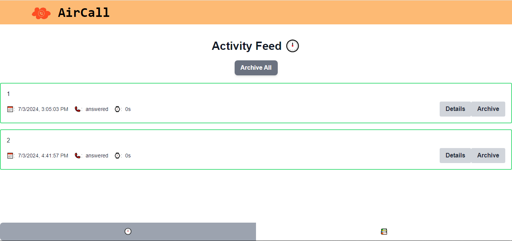

# AirCall

[_Visit the live Demo here_](https://b693f932.onrender.com/)

This is a small ReactJS app that uses the [AirCall API.](https://github.com/speer-technologies/aircall/)

## Features

- Activity Feed - List of calls
- Archive Feed - List of archived calls
- Activity Detail Button - Details of a call
- Archive Button - Archive and unarchive a call.
- Archive All Button - Archives calls in the activity feed
- Unarchive All Button - Unarchives calls in the archive feed

## Technology

I kept the tech stack simple. ReactJS for the frontend, Vite for tooling and Tailwind CSS for styling.

## Methodology

My philosophy when creating this app was to make the UI/UX look and feel good, while following React best practices and maintaining code readability.
I did this by:

- Using icons whenever I could in place of text
- Keeping the ui simple
- Soft colours and transitions
- Conditionally rendering components
- Making use of modular code

## Lessons learned

I decided to use tailwind CSS, even though I have never used it before. While building this app, I was able to learn tailwind CSS and will definitely use it again in the future.

## Future

The only problem that I ran into while making this app is the archive button. While it does archive/unarchive a call on the client. It does not archive/unarchive a call on the server. Thus, leading to issues. For the future I'd spend more time working on this button so that it works correctly.
